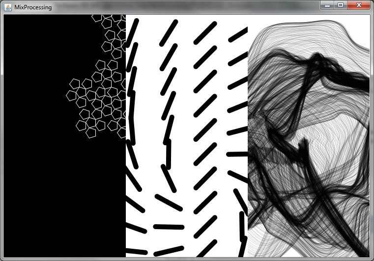

# MixProcessing

This project aims to mix [Processing](http://www.processing.org/) sketches live (also called [VJing](http://en.wikipedia.org/wiki/VJing)). 

##What is MixProcessing?
>MixProcessing can be used for VJing Processing sketches. The user defines output channels, which are free ediable areas on a output devices. The sketches can be controlled to render to any of the devices. A mixer let you control the output. Later there is a common interface for sketches planned, to set parameters (colors, speed, etc.) within MixProcessing live.

The technique of output channels also can be used to create [mapping](http://en.wikipedia.org/wiki/Projection_mapping) ([example 1](http://www.vjseptum.com/wp-content/uploads/2013/01/Coliseum_VO_003.jpg)).

MixProcessing handels compiled Processing sketches, they have to be exported.

##Dependencies
The project needs the Processing core library.

##Status
Currently there is a tech demo, that loades all sketches from a subfolder and renders them into a divided frame. Sketches have to use Java2D, P2D or P3D does not work.

Rather than just divide the area into equal rectangles the current codebase of the tech demo also would allow free forms (circles, stars, etc.), but this will be made accessable later.

##Roadmap
* Building an interface for editing the channels
* Building a mixer interface
* Define software interface for sketch-settings
* Build interface for editing sketch-settings
